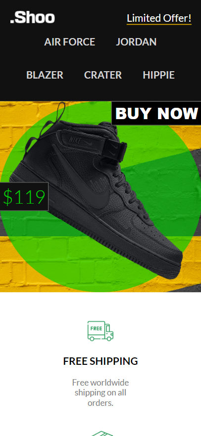

Based on the provided API endpoints and models, we can create a structured and informative README section for your project. Here's a detailed breakdown:

### Description

**Shoo Store - E-commerce Website**

Shoo Store is a fully responsive landing page for an online shoe store. The project utilizes HTML, CSS, and JavaScript to create an interactive and visually appealing shopping experience. The backend is powered by various API endpoints that handle product information, user authentication, and order management.

### API Endpoints

#### Product Endpoints

| Method | Endpoint                             | Description                                      |
|--------|--------------------------------------|--------------------------------------------------|
| GET    | /api/Product                         | Fetch all products                               |
| GET    | /api/Product/getProductByCategory    | Fetch products by category                       |
| GET    | /api/Product/getProductByFeature     | Fetch featured products                          |
| GET    | /api/Product/getAllCategory          | Fetch all product categories                     |
| GET    | /api/Product/getpaging                | Fetch products with pagination                   |
| GET    | /api/Product/getbyid                 | Fetch product by ID                              |
| GET    | /api/Product/getAllStore             | Fetch all stores                                 |

#### User Endpoints

| Method | Endpoint                        | Description                                  |
|--------|---------------------------------|----------------------------------------------|
| POST   | /api/Users/signup               | User signup                                  |
| POST   | /api/Users/signin               | User signin                                  |
| POST   | /api/Users/facebooklogin        | User login via Facebook                      |
| POST   | /api/Users/getProfile           | Get user profile                             |
| POST   | /api/Users/updateProfile        | Update user profile                          |
| POST   | /api/Users/changePassword       | Change user password                         |
| POST   | /api/Users/deleteOrder          | Delete user order                            |
| POST   | /api/Users/OrderApproval        | Approve user order                           |
| POST   | /api/Users/order                | Place an order                               |
| POST   | /api/Users/uploadavatar         | Upload user avatar                           |
| GET    | /api/Users/like                 | Like a product                               |
| GET    | /api/Users/unlike               | Unlike a product                             |
| GET    | /api/Users/getproductfavorite   | Get favorite products                        |

### Models

#### Product Models

| Model                   | Description                                  |
|-------------------------|----------------------------------------------|
| InfoUser                | Information about the user                   |
| UserLogin               | User login details                           |
| DangNhapFacebookViewModel | Facebook login details                    |
| UserNewPassword         | Model for new user password                  |
| OrderDestroy            | Model for order cancellation                 |
| OrderViewModel          | Model for viewing orders                     |
| OrderDetail             | Detailed information about an order          |

### Project Structure

The project is structured to provide a seamless and engaging user experience. The frontend uses modern web development practices to ensure responsiveness and interactivity, while the backend API supports various operations for product and user management.

### Features

- **Responsive Design**: Works on both desktop and mobile devices.
- **User Authentication**: Sign up, sign in, and manage profiles securely.
- **Product Management**: View, search, and filter products by categories and features.
- **Order Management**: Place orders and manage them easily.

### How to Run

1. **Clone the repository**:
   ```bash
   git clone <repository-url>
   cd Shoo-Store
   ```

2. **Open the `index.html` file in a web browser** to view the frontend.

3. **Configure the backend** by setting up the API endpoints as described above.

### Screenshots

#### Desktop


#### Mobile




### Contributors

| Team Member    | Contribution                                     |
|----------------|--------------------------------------------------|
| **Trung Hieu** | API Routing for index.html, in charge of index.js|
| **Toan Phan**  | Styling for the whole page using SASS            |
| **Hau**        | In charge of creating SignIn and SignUp windows  |

### Conclusion

Shoo Store is a comprehensive e-commerce platform designed to provide users with a seamless shopping experience. With a robust backend and an engaging frontend, it serves as a perfect example of a modern web application.

Feel free to customize the details according to your project specifics.
